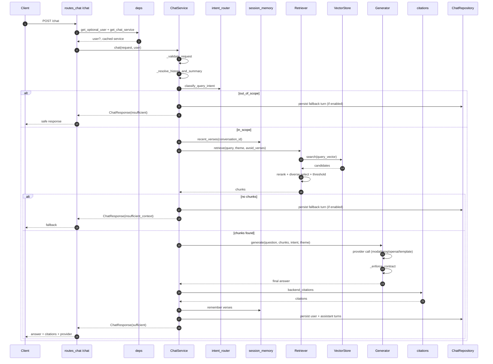
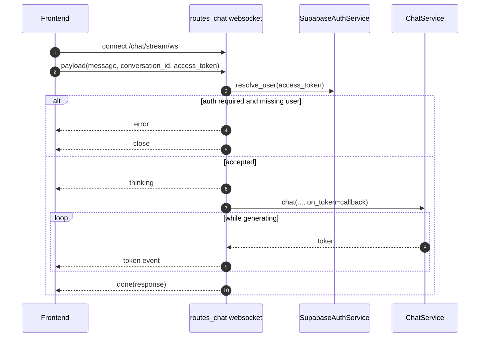
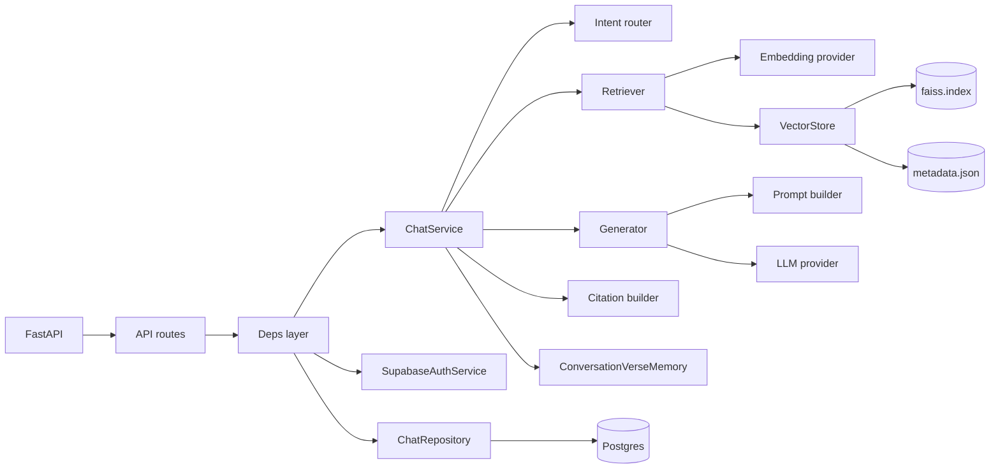
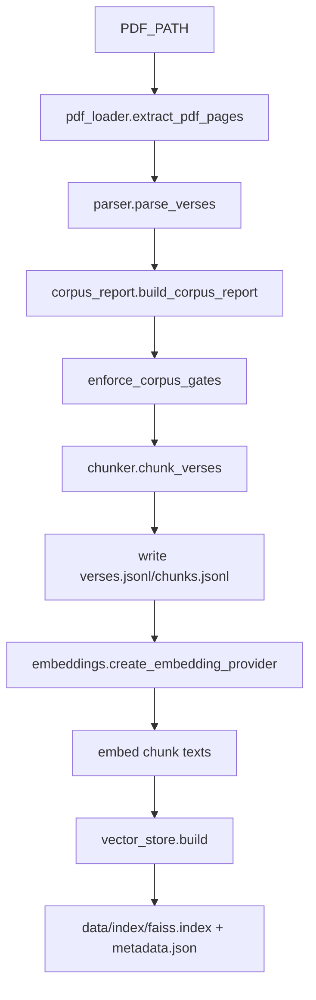
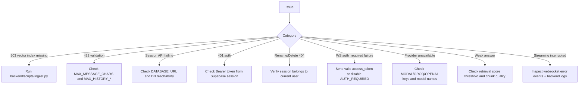

# GitaGPT Backend Diagrams and Cheat Sheet

Fast companion to [RAG_FLOW_FROM_SCRATCH.md](RAG_FLOW_FROM_SCRATCH.md).

Use this file when you want visual recall in minutes.

## 1) POST /chat sequence

## 2) WS /chat/stream/ws sequence

## 3) Runtime component map

## 4) Ingestion map

## 5) Quick file recall

- [backend/app/api/routes_chat.py](backend/app/api/routes_chat.py): chat + sessions + websocket
- [backend/app/api/deps.py](backend/app/api/deps.py): auth and service wiring
- [backend/app/services/chat_service.py](backend/app/services/chat_service.py): end-to-end orchestration
- [backend/app/services/chat_repository.py](backend/app/services/chat_repository.py): DB persistence
- [backend/app/services/auth_service.py](backend/app/services/auth_service.py): Supabase user lookup
- [backend/app/rag/retriever.py](backend/app/rag/retriever.py): retrieve/rerank/diversify
- [backend/app/rag/generator.py](backend/app/rag/generator.py): provider routing + contract gate
- [backend/app/rag/prompt.py](backend/app/rag/prompt.py): prompt assembly
- [backend/app/models/chat.py](backend/app/models/chat.py): request/response/session/stream contracts
- [backend/sql/chat_schema.sql](backend/sql/chat_schema.sql): SQL schema for persistence tables + indexes

## 5.1 Route checklist (including new additions)

- POST /chat
- GET /chat/sessions
- POST /chat/sessions
- PATCH /chat/sessions/{session_id}
- DELETE /chat/sessions/{session_id}
- DELETE /sessions/{session_id} (compat alias)
- GET /chat/sessions/{session_id}/messages
- WS /chat/stream/ws

## 6) Function cheat sheet

### ChatService

- chat: complete request pipeline
- _resolve_history_and_summary: memory enrichment from DB
- _build_memory_context: compacts recent turns for prompt
- _persist_turn: writes message rows and summary

### deps.py

- get_optional_user: parses/validates Bearer token
- get_current_user: enforced auth dependency
- get_chat_service/get_chat_repository/get_auth_service: cached service graph

### Retriever

- retrieve: candidate search and filtering
- _rerank: semantic score shaping
- _select_diverse: verse/type diversity enforcement

### Generator

- generate: provider dispatch
- _generate_with_modal_fallback: modal then groq
- _modal/_groq/_openai: provider adapters
- _template_answer: deterministic fallback
- _enforce_contract: output quality gate

### ChatRepository

- ensure_session: creates session lazily and upgrades placeholder title
- rename_session/delete_session: authenticated ownership-checked mutations
- list_messages: ownership-gated read of stored transcript
- refresh_summary: keeps session summary fresh from latest turns

## 7) Debug decision tree

## 8) One-line memory hook

V I R G V C P R

Validate -> Intent -> Retrieve -> Generate -> Verify -> Cite -> Persist -> Return
