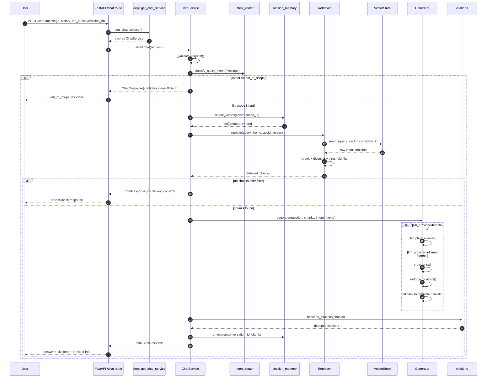
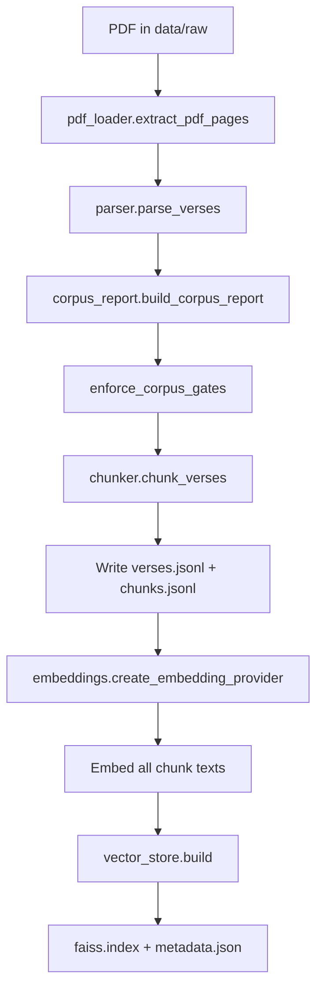
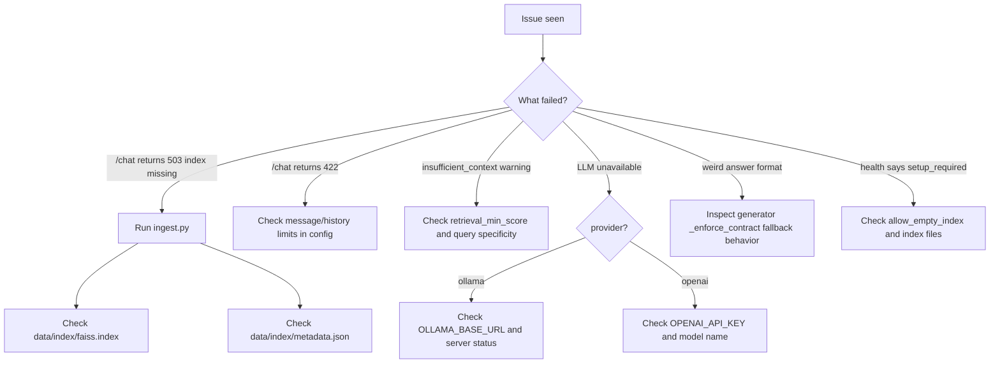

# GitaGPT RAG Diagrams and Cheat Sheet

This file is a fast-revision companion for [RAG_FLOW_FROM_SCRATCH.md](RAG_FLOW_FROM_SCRATCH.md).

Use this when you want:
- visual flow first
- quick debugging map
- interview-style recall in 5-10 minutes

---

## 1) Runtime Sequence: POST /chat



---

## 2) Runtime Component Diagram

```mermaid
flowchart LR
    A[FastAPI app] --> B[/chat route]
    B --> C[ChatService]

    C --> D[intent_router]
    C --> E[session_memory]
    C --> F[Retriever]
    F --> G[Embedding Provider]
    F --> H[VectorStore]
    C --> I[Generator]
    I --> J[prompt builder]
    I --> K[LLM provider: template/ollama/openai]
    C --> L[citations]

    subgraph Data Files
      M[data/processed/chunks.jsonl]
      N[data/index/faiss.index]
      O[data/index/metadata.json]
      P[data/processed/corpus_report.json]
    end

    H --> N
    H --> O
    J --> M
    A --> P
```

---

## 3) Ingestion Pipeline (Build index before chat)



---

## 4) Super-Quick File Recall (Core Only)

- [backend/app/main.py](backend/app/main.py): app factory + CORS + router mounting
- [backend/app/api/routes_chat.py](backend/app/api/routes_chat.py): POST /chat entry point
- [backend/app/services/chat_service.py](backend/app/services/chat_service.py): end-to-end orchestrator
- [backend/app/rag/retriever.py](backend/app/rag/retriever.py): retrieve, rerank, diversify
- [backend/app/rag/generator.py](backend/app/rag/generator.py): generate + enforce output contract
- [backend/app/rag/prompt.py](backend/app/rag/prompt.py): system prompt + user prompt builder
- [backend/app/rag/vector_store.py](backend/app/rag/vector_store.py): index load/search
- [backend/scripts/ingest.py](backend/scripts/ingest.py): build full searchable index

---

## 5) 30-Second Function Cheat Sheet

### chat_service.py

- __init__: wires embeddings, vector store, retriever, generator, memory
- chat: validate -> classify -> retrieve -> generate -> cite -> remember -> respond
- _validate_request: enforces message/history limits

### retriever.py

- retrieve: query embedding -> vector search -> rerank -> diversify -> filter
- _rerank: boosts seed verses and preferred chunk types, penalizes recent
- _select_diverse: avoid same verse flooding results

### generator.py

- generate: provider switch (template/ollama/openai)
- _ollama: local LLM call + compact retry on length
- _openai: OpenAI call with same format objective
- _template_answer: deterministic fallback composer
- _enforce_contract: checks structure and quality, then fallback if needed
- _post_process_answer: final polish (bullets/text cleanup)

---

## 6) Debug Decision Tree



---

## 7) Important Paths to Remember

- [backend/data/raw/Bhagavad-Gita As It Is.pdf](backend/data/raw/Bhagavad-Gita%20As%20It%20Is.pdf): source corpus
- [backend/data/processed/verses.jsonl](backend/data/processed/verses.jsonl): parsed verses
- [backend/data/processed/chunks.jsonl](backend/data/processed/chunks.jsonl): retrieval units
- [backend/data/index/faiss.index](backend/data/index/faiss.index): vector search index
- [backend/data/index/metadata.json](backend/data/index/metadata.json): chunk metadata and build info
- [backend/data/processed/corpus_report.json](backend/data/processed/corpus_report.json): corpus quality and counts

---

## 8) Oral Viva Style One-Liners

- Why RAG? To force grounding in source text before generation.
- Why retriever rerank? Raw similarity alone is not enough; we need theme relevance and diversity.
- Why generator contract checks? LLM output can drift; contract keeps structure and quality stable.
- Why citations? Trust boundary: answer must point to retrieved evidence.
- Why ingestion script? Without index build, retrieval cannot happen, so chat cannot be grounded.

---

## 9) Exam-Time Memory Hook

Remember this chain:

Validate -> Intent -> Retrieve -> Generate -> Verify -> Cite -> Return

Or shorter:

V I R G V C R
